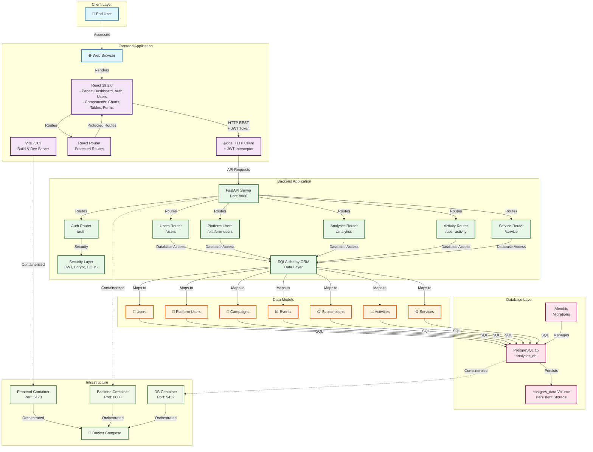
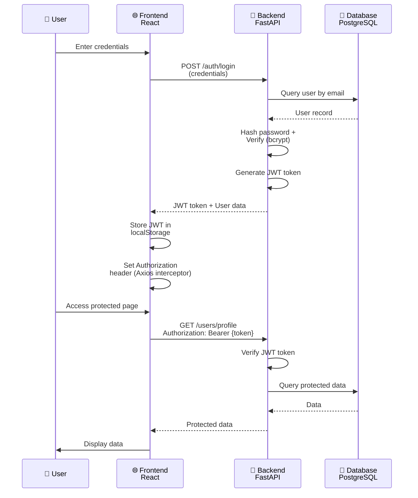
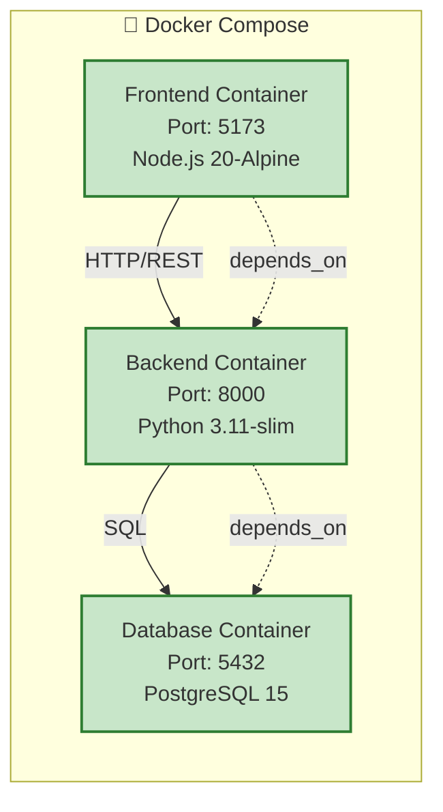
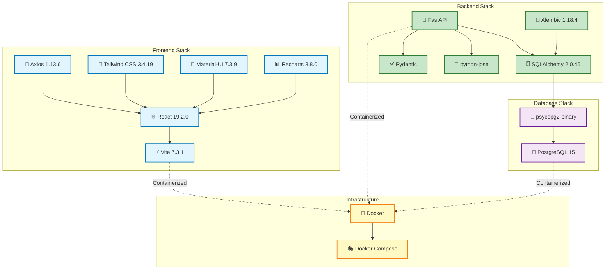
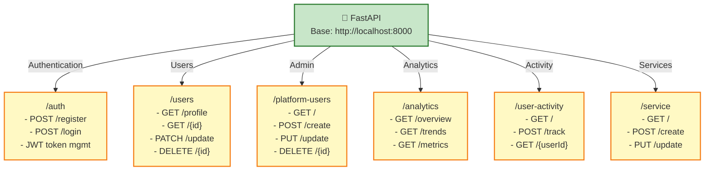

# User Analytics Platform - Architecture Diagram

## System Architecture

## Authentication Flow

## Docker Compose Services

## Technology Stack

## Key Endpoints

## Project Statistics

| Component | Details |
|-----------|---------|
| **Frontend** | React + Vite, Tailwind CSS, Material-UI |
| **Backend** | FastAPI (Python), SQLAlchemy ORM |
| **Database** | PostgreSQL 15 |
| **Frontend Port** | 5173 (Vite dev server) |
| **Backend Port** | 8000 (Uvicorn) |
| **Database Port** | 5432 (PostgreSQL) |
| **Authentication** | JWT + Bcrypt |
| **Infrastructure** | Docker + Docker Compose |
| **Persistence** | `postgres_data` volume |
| **Key Features** | Analytics Dashboard, User Management, Activity Tracking, Role-based Access |

